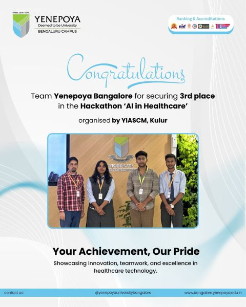

# AI-Based Pneumonia Detection from Chest X-Ray Images

🏆 **3rd Place — AI in Healthcare Hackathon**
Organized by **YIASCM, Yenepoya University Bangalore**

**Author:** Sandesh Lamichhane
MSc AI / Machine Learning / Data Science

---

# Project Overview

This project presents an **AI-based medical image classification system** designed to detect **pneumonia from chest X-ray images**.

Pneumonia is a serious lung infection that can be life-threatening if not detected early. This system uses **deep learning and transfer learning** to automatically analyze X-ray images and classify them as:

* **Normal**
* **Pneumonia**

The project was developed during the **AI in Healthcare Hackathon** and secured **3rd place**.

---

# Why This Project Matters

Early detection of pneumonia is critical for patient survival. However, many healthcare systems face shortages of trained radiologists.

AI-based medical imaging systems can assist doctors by:

* Automatically analyzing chest X-ray images
* Detecting potential pneumonia cases
* Supporting clinical decision making
* Reducing diagnostic workload

This project demonstrates how **deep learning can assist healthcare professionals in medical image analysis**.

---

# Hackathon Achievement



---

# Dataset

Dataset used:

**Chest X-Ray Pneumonia Dataset**

Source: Kaggle

Dataset structure:

```
chest_xray
│
├── train
│   ├── NORMAL
│   └── PNEUMONIA
│
├── val
│   ├── NORMAL
│   └── PNEUMONIA
```

Each image represents a **chest X-ray scan** labeled as:

* Normal lung
* Pneumonia infected lung

---

# Model Architecture

The system uses **Transfer Learning with EfficientNetB0**, a powerful convolutional neural network pretrained on the **ImageNet dataset**.

Model pipeline:

```
Input Image (192x192)
        ↓
EfficientNetB0 (Feature Extraction)
        ↓
Global Average Pooling
        ↓
Dropout Layer
        ↓
Dense Layer (Sigmoid)
        ↓
Binary Classification
```

Output:

* **0 → Normal**
* **1 → Pneumonia**

Transfer learning allows the model to leverage **pretrained visual features**, improving performance even with limited medical datasets.

---

# Technologies Used

* Python
* TensorFlow / Keras
* EfficientNet
* NumPy
* Pandas
* Scikit-learn
* Jupyter Notebook

---

# Training Configuration

**Optimizer**

Adam

**Learning Rate**

0.0001

**Loss Function**

Binary Cross Entropy

**Metrics Used**

* Accuracy
* AUC
* Precision
* Recall

These metrics are important for evaluating **medical classification systems**.

---

# Results

The model demonstrates strong performance in detecting pneumonia cases from chest X-ray images.

Key evaluation metrics include:

* **Accuracy**
* **Precision**
* **Recall (Sensitivity)**
* **AUC Score**

In medical diagnosis systems, **high recall (sensitivity)** is particularly important to ensure pneumonia cases are not missed.

---

# Evaluation Metrics

The model is evaluated using a **confusion matrix**.

Important healthcare metrics:

**Sensitivity (Recall)**
Measures how well the system detects pneumonia patients.

**Specificity**
Measures how accurately healthy patients are identified.

These metrics are critical for **medical AI applications** where diagnostic accuracy is essential.

---

# Project Structure

```
AI-Healthcare-Hackathon
│
├── data
│   └── sample_data.csv
│
├── notebooks
│   └── yenepoya_.ipynb
│
├── src
│   └── model.py
│
├── results
│
├── hackathon_result.jpg
├── README.md
├── requirements.txt
└── LICENSE
```

---

# Installation

Clone the repository:

```
git clone https://github.com/sandesh20lamichhane/AI-Healthcare-Hackathon.git
cd AI-Healthcare-Hackathon
```

Install dependencies:

```
pip install -r requirements.txt
```

Run the notebook:

```
jupyter notebook notebooks/yenepoya_.ipynb
```

---

# Future Improvements

Possible future work includes:

* Explainable AI using **Grad-CAM visualization**
* Training with **larger medical datasets**
* **Multi-disease classification**
* Deployment as a **web-based healthcare AI system**

---

# License

This project is licensed under the **MIT License**.

See the `LICENSE` file for full license details.
